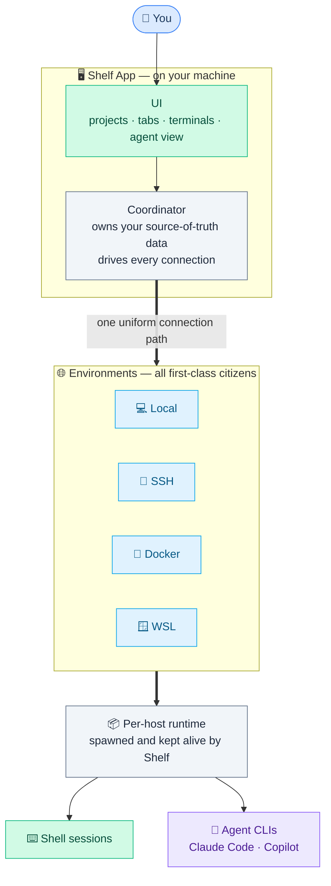
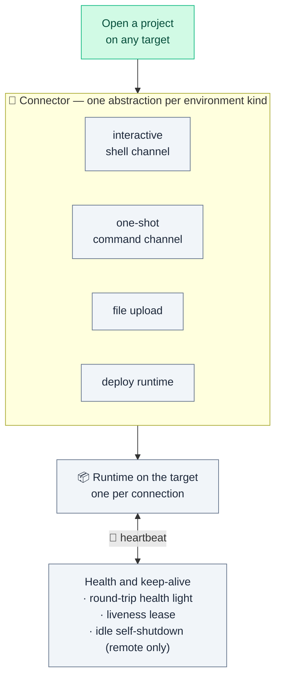
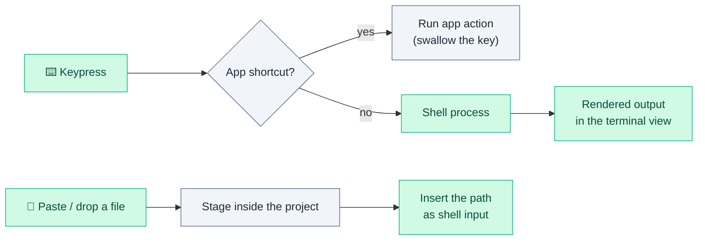
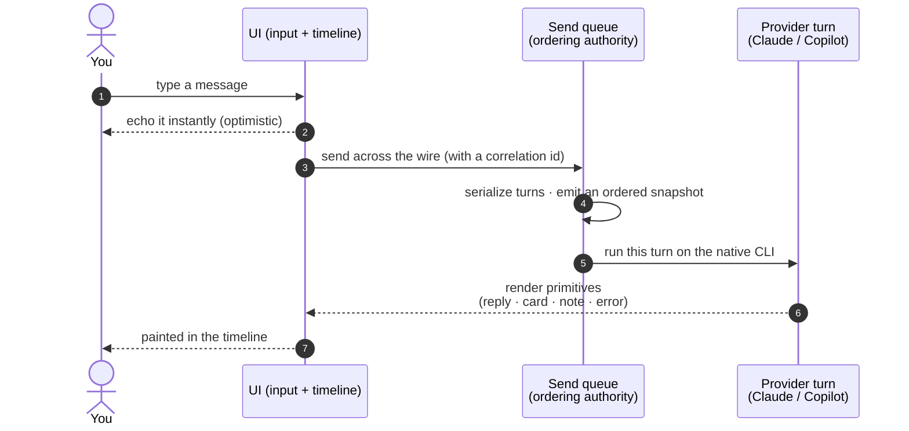
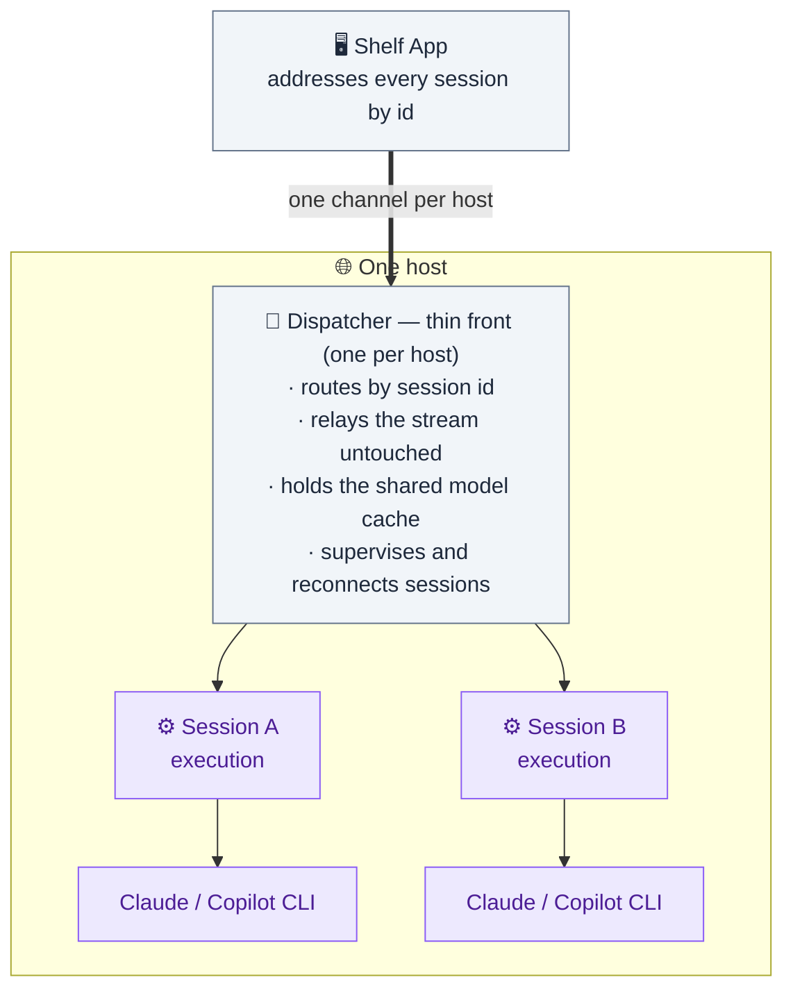
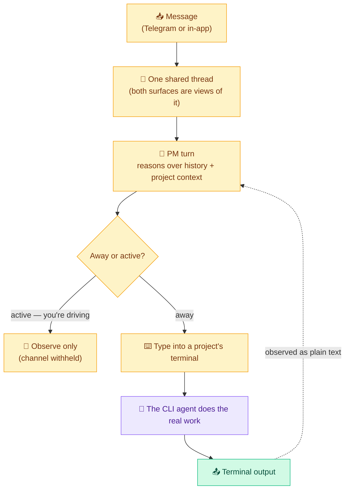

# Shelf — Architecture at a Glance

> A high-level, abstract tour of how Shelf is put together. It's meant to be
> *readable*, not exhaustive — no file names, no class names, just the big pieces
> and how they talk to each other. All diagrams render directly on GitHub.

Shelf is a **project-based terminal manager**: open many terminals across many
projects and environments without paying a housekeeping tax. Everything below
hangs off that one idea — the terminal is the core; the agent view and the PM
supervisor are comfortable add-ons layered on top.

**Colour legend** (used throughout):

| 🟩 Terminal / core | 🟪 Agent | 🟨 PM supervisor | ⬜ Plumbing | 🟦 You / environments |
|---|---|---|---|---|

---

## 1. The big picture

You drive a UI; Shelf owns your data and drives every connection; each
environment — local, SSH, Docker, or WSL — hosts a runtime that Shelf spawns and
keeps alive. The same shape holds everywhere.

The rule that keeps this simple: **Shelf owns the canonical data; each host only
holds a disposable copy** that can be rebuilt at any time. Data always flows
*out* from the app to the host — the app never reaches into a host's filesystem.

---

## 2. Connecting a project — one path, every environment

Whether the work runs on your own machine or a box on the other side of the
world, it goes through **one uniform pathway**. Only the lowest layer that
actually moves bytes differs per environment, and that difference is hidden
behind a single "connector" role — so nothing above ever has to care *where* the
work runs.

- **Adding a new environment kind = adding one connector**, not editing every
  call site.
- A steady **heartbeat** does triple duty: it powers the per-project health
  light, refreshes a keep-alive lease so unused runtimes get reclaimed later, and
  lets an idle *remote* host shut itself down instead of burning resources while
  you sleep.

---

## 3. How the terminal moves bytes

Two interleaved tracks. Keystrokes are either claimed by an app shortcut or
passed straight through to the shell; pasted/dropped files are staged inside the
project so the shell can refer to them by path.

---

## 4. The agent view, end to end

### 4a. One message → one rendered turn

You own drafting and display; the backend owns ordering and turn boundaries.
What crosses the wire back to the UI is always **render primitives** (a reply, a
foldable card, a note, an error) — never raw provider vocabulary. So the UI never
needs to know a tool name or a slash-command grammar.

The queue is the single source of order: queued items draw as chips, and when one
flips to *running* the optimistic bubble is promoted into a real one. Config
edits (model / effort / permission) and pop-up pickers ride the *same* machinery
rather than opening side channels.

### 4b. Where those turns actually run

One host can hold many agent sessions. A thin, provider-agnostic **dispatcher**
sits in front of them: it routes by session id, relays the token stream
untouched, and supervises the per-session execution units that actually run the
CLI.

Three ideas keep this robust:

- **The front stays dumb on purpose.** It forwards the stream verbatim and only
  peeks at the handful of messages it services itself (a health reply, a cache
  lookup). Little logic means little to crash — and a frozen front can't freeze
  the whole host.
- **Health is checked at two levels.** The app beats against the *dispatcher*
  (is the host reachable?), and the dispatcher beats against *each execution*
  (is this one session hung?). A single stuck session is severed alone; its
  siblings are untouched.
- **Recovery is fail-loud, then reconnect.** If an execution dies, the loss is
  surfaced first — your spinner unsticks, the interrupted turn is visible — and
  only then is a fresh execution brought up and the conversation *resumed* from
  its last committed boundary. Never a silent gap.

---

## 5. The PM supervisor (optional)

The PM agent is a background supervisor. It's reactive — it wakes on a message,
reasons once, and its **only lever on the world is typing into a terminal**.
Everything it accomplishes is done by the CLI agent already living in that
terminal; the PM never runs commands or touches files itself.

A single global **away / active** switch gates authority: *active* means you're
at the keyboard and the PM only watches; *away* hands it the terminal channel.
The gate is enforced by physically withholding the channel, not by instruction.

---

## Design principles

The whole system is shaped by a few non-negotiables:

1. **Core stable, extras swappable.** Project-based terminal management is the
   reason Shelf exists. Agent view, PM, notes, dev tools — all bonuses that can
   grow, shrink, or change without holding the core hostage.
2. **Every environment is first-class.** Local, SSH, Docker, and WSL are treated
   identically; remote execution is the normal case, not an edge case.
3. **Zero setup for you.** Install and go — no requirement to install Node,
   Python, or extra CLIs yourself (only provider sign-in, e.g. Claude / GitHub).
   Locally, Shelf runs on the Node runtime embedded in the app itself; on a
   remote it ships its own pinned Node. The one exception is a musl-based
   remote (e.g. Alpine Linux), which must already have Node installed because
   no official musl Node build exists to ship.
4. **Native stays native.** Where Claude / Copilot support something natively
   (skills, MCP, slash commands), Shelf opens it up and follows native behaviour
   rather than shipping a degraded copy.
5. **Not an IDE.** Shelf replaces the *tmux* layer (session management), not the
   editor. No built-in code editor, file tree, or language server — on purpose.
